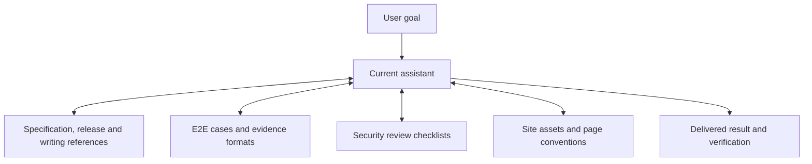

<div align="center">

# H-Level Model Skills

Professional references and reusable assets for highly autonomous models.

[](#plugins)
[](#skills)
[](LICENSE)

`h-level-product` • `h-level-qa` • `h-level-security` • `h-level-docs`

[Quick Start](#quick-start) • [Usage Examples](#usage-examples) • [Plugins](#plugins) • [Combining Skills](#combining-skills) • [Documentation](#documentation)

</div>

> [!NOTE]
> Other languages: [中文](./README_zh.md)

## Overview

H-Level Model Skills publishes four plugins and eight directly usable skills from one marketplace, covering specifications, releases, E2E testing, security reviews, documentation sites, and Chinese writing.

The library is intended for models that can already research, understand code, implement changes, debug, and verify results independently. Skills provide references and assets worth reusing consistently; the assistant selects the relevant material for each task.

The repository includes:

- PRD, TRD, API, ADR, and test specification templates, with document states and feature-path conventions.
- Version, tag, and artifact handling for changelogs, site notes, and GitHub Releases.
- Reusable E2E cases, account references, execution records, and security review checklists.
- VitePress assets, templates, navigation, public/internal builds, and local checks.
- Illustrated manual guidance based on actual interfaces, and the retained `human-writing` preferences.
- Claude Code marketplace configuration, a Kimi Code manifest, and an independent Codex installer.

The assistant owns the requested outcome and combines these materials within the same task. Formal specifications, persistent cases, and standalone reports are chosen according to the task and the host project's conventions.

> [!IMPORTANT]
> **Relationship to the original library:** this repository is derived from [dev-agent-skills](https://github.com/Neplich/dev-agent-skills). The original retains 37 skills for models that benefit from detailed procedural guidance. This library retains eight entries focused on assets, formats, and preferences. See the [migration guide](./docs/migration.md) for the complete removal and merge map.

## Quick Start

### Claude Code

Add the marketplace, then install the plugins useful to your work:

```text
/plugin marketplace add Neplich/h-level-model-skills

/plugin install h-level-product@h-level-model-skills
/plugin install h-level-qa@h-level-model-skills
/plugin install h-level-security@h-level-model-skills
/plugin install h-level-docs@h-level-model-skills
```

The product plugin contains specification, release, and writing references. QA provides E2E case and execution conventions. Security contains focused review checklists. Docs provides site assets, document maintenance, and illustrated manuals. Each plugin has its own detailed guide below.

### Codex

Tell Codex:

```text
Fetch and follow instructions from https://raw.githubusercontent.com/Neplich/h-level-model-skills/refs/heads/main/.codex/INSTALL.md
```

Choose a personal installation for use across projects or a project installation for one repository. The installer exposes all eight skills through relative symlinks and preserves references in an independent `.h-level-model-skills/` hidden mirror.

For an existing checkout and a chosen target directory, run from the repository root:

```bash
python3 scripts/install_codex_skills.py --target /path/to/skills
```

Re-run the installer after updating the checkout to refresh this library's installed content. See the [Codex Guide](./docs/README.codex.md) for paths, mirror ownership, and conflict handling.

### Kimi Code

Install the native plugin from the current source:

```text
/plugins install https://github.com/Neplich/h-level-model-skills/tree/main
```

The repository's `.kimi-plugin/plugin.json` registers four skill directories as one plugin. Select capabilities for the task or name a skill through the host's skill picker.

For a pinned installation, choose a release tag that actually exists in this repository. Historical upstream changelogs do not establish releases in this repository.

### Coexisting with the Original Library

The new library has separate marketplace and plugin names and an independent Codex mirror identity. Installing or updating it does not uninstall the original library.

If the target already contains entries such as `human-writing`, `docs-site-bootstrap`, or `manual-gen` owned by another installation, the Codex installer preserves them and reports `skipped`. With `--force`, these entries produce a conflict rather than being overwritten. To switch libraries, identify the affected entries first and choose the installation scope or replacement explicitly.

## Scope

The assistant can handle ordinary research, code analysis, implementation, debugging, test writing, and deployment directly. Select a skill when the task benefits from this library's reusable templates, formats, or assets.

For example, use `spec-authoring` for maintained interface designs, `e2e-testing` for reproducible user journeys, and the docs plugin for the packaged VitePress site. Combine `human-writing` with these capabilities to retain useful detail and the intended writing preferences.

Existing project formats, test harnesses, and tools take precedence. Installing a security or specification skill does not require every feature change to produce an audit report or formal document.

## Usage Examples

Describe the task directly or select one of these registered names through the host:

```text
Use spec-authoring to document the team permission redesign as a TRD and API contract in our existing docs directory.
Use release-management to prepare release notes from v1.2.0 to the current commit; deliver a text preview first.
Use e2e-testing to verify checkout, save reusable cases, and distinguish failures from scenarios that did not run.
Use security-review to inspect object authorization and tenant isolation in the export endpoint, with code evidence.
```

For documentation work, choose the intended artifact:

```text
Use docs-site-bootstrap to initialize a VitePress documentation site with public/internal builds.
Use docs-maintenance to update API pages, indexes, and change-map after this interface change.
Use manual-gen to document account setup from the running interface, including real screenshots and recovery steps.
Use human-writing to restore the Chinese README's structure and practical detail while keeping the language clear.
```

Use versions, interfaces, and environments from the actual project. A request can use one skill or combine relevant references within the same task.

## Plugins

| Plugin | Focus | Skills | Docs |
| --- | --- | :---: | --- |
| `h-level-product` | Specification templates, releases, Chinese writing | 3 | [Product and Releases](./agents/product_manager/README.md) |
| `h-level-qa` | Persistent E2E cases, acceptance, defects, regression evidence | 1 | [QA](./agents/qa/README.md) |
| `h-level-security` | Application, authorization, dependency, and privacy reviews | 1 | [Security](./agents/security/README.md) |
| `h-level-docs` | Documentation sites, fact maintenance, illustrated manuals | 3 | [Docs](./agents/docs/README.md) |

Plugins distribute related materials. All eight skills are directly usable, with no additional role-guide entries.

## Skills

| Skill | When to use | Main artifact or resource |
| --- | --- | --- |
| [human-writing](./agents/product_manager/skills/human-writing/SKILL.md) | Write, revise, or audit Chinese prose | Clear prose, document patterns, and revision references |
| [spec-authoring](./agents/product_manager/skills/spec-authoring/SKILL.md) | Maintain a specification or use a requested format | PRD, TRD, API, ADR, and test specification templates |
| [release-management](./agents/product_manager/skills/release-management/SKILL.md) | Prepare changelogs, site notes, or GitHub Releases | Version scope, release text, tag and artifact checks |
| [e2e-testing](./agents/qa/skills/e2e-testing/SKILL.md) | Explore, validate, reproduce, or regress user journeys | Stable case IDs, account references, execution and evidence records |
| [security-review](./agents/security/skills/security-review/SKILL.md) | Explicit security or privacy review requests | Focused checklists, permission matrices, code evidence |
| [docs-maintenance](./agents/docs/skills/docs-maintenance/SKILL.md) | Synchronize or audit documentation against implementation | Page updates, contracts, mappings, and version anchors |
| [docs-site-bootstrap](./agents/docs/skills/docs-site-bootstrap/SKILL.md) | Initialize or update the packaged documentation site | VitePress assets, manifest, navigation, and builds |
| [manual-gen](./agents/docs/skills/manual-gen/SKILL.md) | Document tasks from a running interface | Task pages, real screenshots, outcomes, and recovery steps |

## Combining Skills

The assistant selects references around the user's goal and carries the task through verification:



Common combinations:

1. **Specifications and acceptance:** use `spec-authoring` for maintained interfaces and behavior contracts, with `e2e-testing` when persistent journeys are useful.
2. **Sites and manuals:** prepare the site with `docs-site-bootstrap`, capture interfaces and steps with `manual-gen`, and verify pages and navigation with `docs-maintenance`.
3. **Release preparation:** use `release-management` for a shared version scope, adding `docs-maintenance` when documented facts also need updating.
4. **Chinese prose:** combine `human-writing` with specifications, manuals, or release notes to preserve terminology, actual steps, and practical detail.

Existing authorization carries through the task. Select templates, reports, and checks for the actual scope; publication still follows the user's explicit authorization.

## Documentation

- [Architecture](./docs/architecture.md): plugin organization, distribution, and shared page contracts.
- [Migration Guide](./docs/migration.md): the mapping from 37 entries to eight and installation boundaries.
- [Codex Guide](./docs/README.codex.md): installation, mirror behavior, updates, and conflicts.
- [Documentation Guide](./docs/AGENTS.md): document locations, factual evidence, and reusable test records.
- Maintainer cookbooks: [Skill Maintenance](./docs/cookbook/maintain-skills.md), [Manual Release](./docs/cookbook/release.md).
- [Repository Instructions](./AGENTS.md): working approach, source layout, Git conventions, and verification.
- [Contributing](./CONTRIBUTING.md): local checks and contribution workflow.
- [Changelog Index](./CHANGELOG.md): inherited upstream release records.
- Plugin guides: [Product](./agents/product_manager/README.md), [QA](./agents/qa/README.md), [Security](./agents/security/README.md), [Docs](./agents/docs/README.md).

## Provenance and Versions

Derived from [dev-agent-skills](https://github.com/Neplich/dev-agent-skills) at [`67fd47d3ad2c`](https://github.com/Neplich/dev-agent-skills/commit/67fd47d3ad2c44b441e3b7c4c27cc87d4a595b5c), preserving Git history and the MIT license. This is an independent derived repository without GitHub fork metadata.

Metadata version `0.6.7` is inherited from the upstream baseline, not a release published by this repository. Historical changelogs describe upstream releases. The first independent version is selected through the [manual release procedure](./docs/cookbook/release.md).

## Contributing

See [CONTRIBUTING.md](./CONTRIBUTING.md) for local checks and contributor workflow. `AGENTS.md` is the single source of repository maintenance guidance.

## License

This project is licensed under the [MIT License](./LICENSE).
