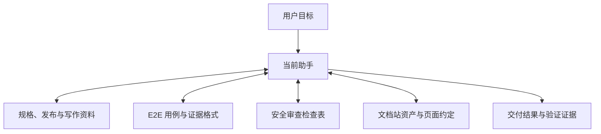

<div align="center">

# H-Level Model Skills

面向高自主能力模型的专业资料与可复用资产库。

[](#插件目录)
[](#skill-清单)
[](LICENSE)

`h-level-product` • `h-level-qa` • `h-level-security` • `h-level-docs`

[快速开始](#快速开始) • [使用示例](#使用示例) • [插件目录](#插件目录) • [能力组合](#能力组合) • [文档索引](#文档索引)

</div>

> [!NOTE]
> 其他语言：[English](./README.md)

## 概览

H-Level Model Skills 将 4 个插件、8 个可直接使用的 Skill 发布在同一个 marketplace 中，涵盖规格模板、发布管理、E2E 测试、安全审查、文档站和中文写作。

本库适合已经能够自主研究、理解代码、实现、调试和验证的模型。Skill 提供需要稳定复用的资料，助手按任务选择所需部分。

仓库内容包括：

- PRD、TRD、API、ADR 和测试规格模板，以及文档状态与功能路径约定。
- Changelog、站内说明和 GitHub Release 的版本、标签与资产处理方法。
- 可复用 E2E 用例、账号引用、执行记录与安全审查检查表。
- VitePress 文档站资产、模板、导航、public/internal 构建与本地检查脚本。
- 基于真实界面的图文手册方法，以及保留原有偏好的 `human-writing`。
- Claude Code marketplace、Kimi Code manifest 和独立的 Codex 安装器。

助手直接负责用户目标，在同一任务中组合这些资料。是否形成正式规格、持久用例或独立报告，取决于任务需要和宿主项目已有约定。

> [!IMPORTANT]
> **与原库的关系**：本库派生自 [dev-agent-skills](https://github.com/Neplich/dev-agent-skills)。原库保留 37 个 Skill，适合需要较详细流程引导的模型；本库保留 8 个入口，侧重资产、格式与偏好。完整删除、合并和保留清单见 [迁移说明](./docs/migration.md)。

## 快速开始

### Claude Code

添加 marketplace，按工作需要安装插件：

```text
/plugin marketplace add Neplich/h-level-model-skills

/plugin install h-level-product@h-level-model-skills
/plugin install h-level-qa@h-level-model-skills
/plugin install h-level-security@h-level-model-skills
/plugin install h-level-docs@h-level-model-skills
```

产品插件包含规格、发布和写作资料；QA 插件提供 E2E 用例与执行约定；安全插件提供专项检查表；文档插件提供站点资产、文档维护和图文手册能力。各插件的完整清单见下方目录。

### Codex

告诉 Codex：

```text
Fetch and follow instructions from https://raw.githubusercontent.com/Neplich/h-level-model-skills/refs/heads/main/.codex/INSTALL.md
```

个人级安装适合跨项目使用，项目级安装适合单个仓库。安装器通过相对软链暴露全部 8 个 Skill，并在独立的 `.h-level-model-skills/` 隐藏镜像中保留参考资料。

已有本地 checkout 且已选好安装目录时，从仓库根目录运行：

```bash
python3 scripts/install_codex_skills.py --target /path/to/skills
```

更新 checkout 后重新运行安装器，即可刷新本库的安装内容。路径选择、镜像归属和冲突处理见 [Codex 安装指南](./docs/README.codex.md)。

### Kimi Code

从当前源码安装原生插件：

```text
/plugins install https://github.com/Neplich/h-level-model-skills/tree/main
```

仓库的 `.kimi-plugin/plugin.json` 将 4 个 Skill 目录注册为一个插件。按任务选择能力，或通过宿主的 Skill 选择器点名使用。

需要固定发布版本时，只选择新仓库实际存在的 release tag；上游历史 changelog 不表示本仓库已经发布了对应版本。

### 与原库共存

新库使用独立的 marketplace、插件名称和 Codex 镜像标识。安装或更新新库不会自动卸载原库。

如果目标目录中已有 `human-writing`、`docs-site-bootstrap` 或 `manual-gen` 等同名入口，Codex 安装器会保留外部入口并报告 `skipped`。`--force` 遇到这些入口也会报冲突，不会覆盖。需要切换时，先确认具体入口的归属，再选择安装范围或替换方式。

## 使用范围

普通研究、代码分析、实现、调试、测试编写和部署工作可由助手直接完成。需要复用本库模板、格式或资产时，再选择对应 Skill。

例如，长期维护接口设计可使用 `spec-authoring`；需要积累可复现用户旅程时使用 `e2e-testing`；项目采用内置 VitePress 站点时使用文档插件。`human-writing` 可与这些能力结合，保留读者需要的细节和写作偏好。

宿主已有格式、测试框架和工具优先。安装了安全或规格能力，并不要求每次功能修改都生成审计报告或正式文档。

## 使用示例

直接描述目标，或通过宿主的 Skill 选择器选择下列名称：

```text
使用 spec-authoring，为团队权限改造整理 TRD 和 API 约定，沿用现有文档目录。
使用 release-management，根据 v1.2.0 到当前提交的变化准备发布说明，先交付文案预览。
使用 e2e-testing，验证结算流程，保存可复用用例并区分失败与未执行场景。
使用 security-review，审查导出接口的对象授权和租户隔离，给出代码证据。
```

文档任务也可以按产物选择：

```text
使用 docs-site-bootstrap，为项目初始化支持 public/internal 构建的 VitePress 文档站。
使用 docs-maintenance，根据这次接口变更更新 API 页面、索引和 change-map。
使用 manual-gen，依据运行中的界面编写账号设置手册，包含真实截图和异常处理。
使用 human-writing，恢复 README 的章节层次和实用细节，保持中文自然清晰。
```

示例中的版本、接口和环境由实际项目提供。每个请求可以只使用一个 Skill，也可以在同一任务内组合相关资料。

## 插件目录

| 插件 | 关注范围 | Skills | 文档 |
| --- | --- | :---: | --- |
| `h-level-product` | 规格模板、版本交付、中文写作 | 3 | [产品与发布](./agents/product_manager/README_zh.md) |
| `h-level-qa` | 持久 E2E 用例、验收、缺陷与回归证据 | 1 | [QA](./agents/qa/README_zh.md) |
| `h-level-security` | 应用、授权、依赖与隐私审查 | 1 | [安全](./agents/security/README_zh.md) |
| `h-level-docs` | 文档站、事实维护与图文操作手册 | 3 | [文档](./agents/docs/README_zh.md) |

插件用于分发相关资料，8 个 Skill 均可直接使用，没有额外的角色导航入口。

## Skill 清单

| Skill | 适用场景 | 主要产物或资源 |
| --- | --- | --- |
| [human-writing](./agents/product_manager/skills/human-writing/SKILL.md) | 编写、修订和审核中文文稿 | 清晰自然的正文、结构与修订参考 |
| [spec-authoring](./agents/product_manager/skills/spec-authoring/SKILL.md) | 需要长期维护或指定格式的规格 | PRD、TRD、API、ADR、测试规格模板 |
| [release-management](./agents/product_manager/skills/release-management/SKILL.md) | 准备变更记录、站内说明或 GitHub Release | 版本范围、正文、标签与资产核对 |
| [e2e-testing](./agents/qa/skills/e2e-testing/SKILL.md) | 探索、验收、复现或回归用户旅程 | 稳定用例 ID、账号引用、执行与证据记录 |
| [security-review](./agents/security/skills/security-review/SKILL.md) | 明确请求安全或隐私审查 | 专项检查表、权限矩阵与代码证据 |
| [docs-maintenance](./agents/docs/skills/docs-maintenance/SKILL.md) | 同步或审计文档与实现的一致性 | 页面更新、字段契约、映射与版本锚 |
| [docs-site-bootstrap](./agents/docs/skills/docs-site-bootstrap/SKILL.md) | 初始化或更新内置文档站 | VitePress 资产、manifest、导航与构建 |
| [manual-gen](./agents/docs/skills/manual-gen/SKILL.md) | 根据运行界面编写操作手册 | 任务页、真实截图、预期结果与恢复说明 |

## 能力组合

助手围绕用户目标选择资料，并持续完成交付与验证：



常见组合：

1. **规格与验收**：用 `spec-authoring` 明确可维护的接口和行为约定，需要持久用户旅程时结合 `e2e-testing`。
2. **文档站与手册**：用 `docs-site-bootstrap` 准备站点，`manual-gen` 采集真实界面与步骤，`docs-maintenance` 核对页面和导航。
3. **版本准备**：用 `release-management` 组织同一版本范围的变更，涉及文档事实更新时结合 `docs-maintenance`。
4. **中文文稿**：在规格、手册或发布说明中结合 `human-writing`，保持术语、真实步骤和有用细节。

已有授权随任务持续有效。资料中的模板、报告和检查表按实际范围选用；发布等操作仍遵循用户的明确授权。

## 文档索引

- [仓库架构](./docs/architecture.md)：插件组织、分发方式和共享页面契约。
- [迁移说明](./docs/migration.md)：从 37 个入口到 8 个入口的对应关系与安装边界。
- [Codex 安装指南](./docs/README.codex.md)：安装、镜像机制、更新和冲突处理。
- [文档说明](./docs/AGENTS.md)：文档位置、事实依据与可复用测试记录。
- 维护 cookbook：[Skill 维护](./docs/cookbook/maintain-skills.md)、[手动发布](./docs/cookbook/release.md)。
- [仓库指导](./AGENTS.md)：工作方式、源码布局、Git 约定和验证。
- [贡献指南](./CONTRIBUTING_zh.md)：本地检查和贡献方式。
- [Changelog 索引](./CHANGELOG.md)：继承的上游版本记录。
- 插件文档：[产品](./agents/product_manager/README_zh.md)、[QA](./agents/qa/README_zh.md)、[安全](./agents/security/README_zh.md)、[文档](./agents/docs/README_zh.md)。

## 来源与版本

本项目派生自 [dev-agent-skills](https://github.com/Neplich/dev-agent-skills)，基线提交为 [`67fd47d3ad2c`](https://github.com/Neplich/dev-agent-skills/commit/67fd47d3ad2c44b441e3b7c4c27cc87d4a595b5c)，保留提交历史与 MIT 许可。新库采用独立派生仓库形式，GitHub 不显示 fork 关系。

当前元数据版本 `0.6.7` 继承自上游基线，不代表本仓库已发布该版本。历史 changelog 描述上游事实；本库首次独立发布按 [手动发布流程](./docs/cookbook/release.md) 确定版本。

## 贡献

本地检查和贡献流程见 [CONTRIBUTING_zh.md](./CONTRIBUTING_zh.md)。`AGENTS.md` 是仓库维护指导的唯一事实源。

## License

本项目使用 [MIT License](./LICENSE)。
